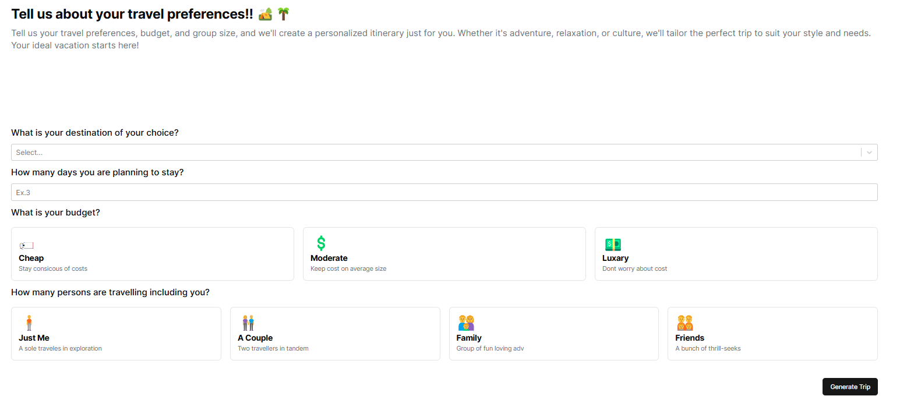
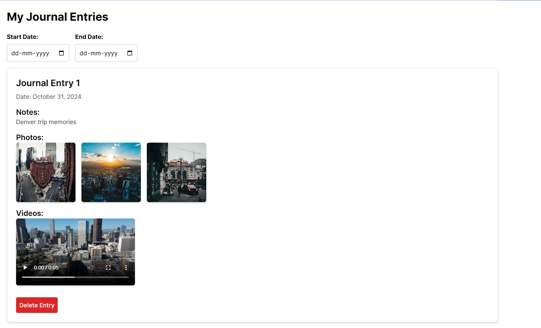

# JourneyGenie

JourneyGenie is a sophisticated AI-powered trip planning platform that streamlines the travel experience by offering personalized recommendations, seamless flight and hotel booking, and intuitive trip journaling. With the integration of external APIs and a user-friendly design, JourneyGenie is designed to cater to the needs of modern travelers, ensuring ease of use and accessibility. 

## Prerequisites

Before getting started, make sure you have the following installed:

- [Node.js](https://nodejs.org/) (version 12 or higher)
- [npm](https://www.npmjs.com/) (comes with Node.js)

## How to Run the Website Locally

Follow these steps to set up and run the JourneyGenie website on your local machine.

### 1. Clone the Repository

First, clone the repository from the main branch using the following command:

```bash
git clone https://github.com/NandishDPatel/JourneyGenie.git
```


## Project Photos
- Landing page


- Google Authentication


- Trip generation page


- Result after generating the trip for Chicago city


- Flight search feature


- Journal entries for keeping a track of different trips


